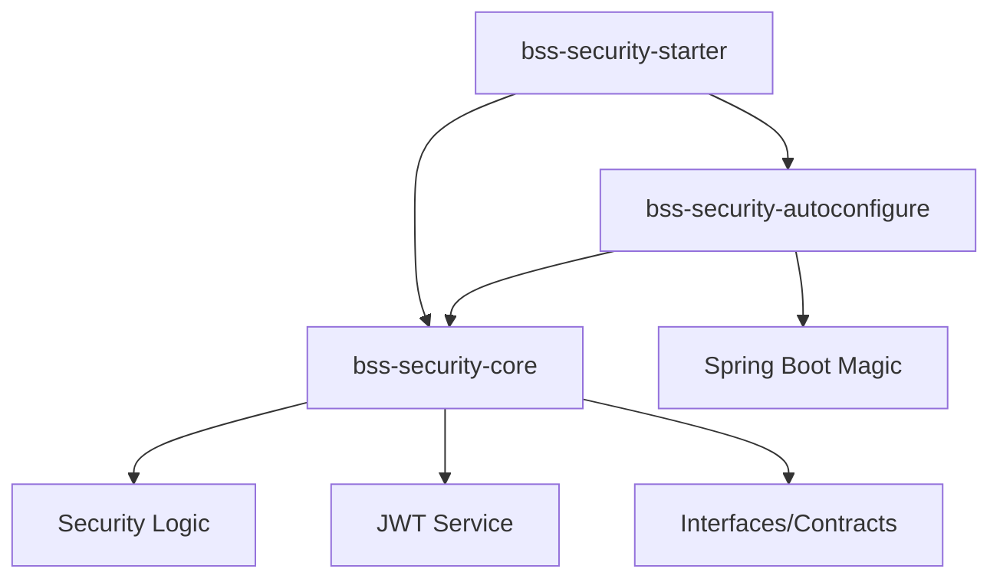
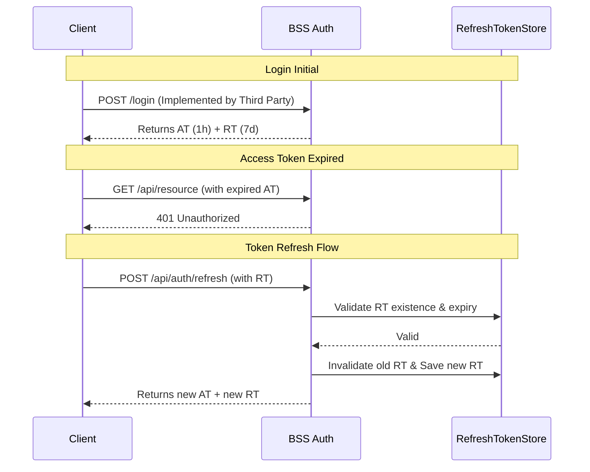

# 🚀 Backend Security Starter (BSS)

Reusable and scalable security component (Starter) for microservices, prioritizing simplicity, functionality, and ease of integration for third parties.

## 🎯 Objetivo
Proveer una solución de seguridad robusta, desacoplada y de alto rendimiento para aplicaciones Spring Boot, facilitando la implementación de autenticación JWT Stateless con soporte para Refresh Tokens y una API de gestión integrada.

## 🏗 Arquitectura del Sistema

El proyecto sigue una estructura multi-módulo para separar la lógica pura del mecanismo de autoconfiguración de Spring Boot.



1.  **bss-security-core:** Contiene los filtros, servicios de JWT, modelos y las interfaces (`SecurityUser`, `RefreshTokenRepository`). Es totalmente agnóstico a la infraestructura.
2.  **bss-security-autoconfigure:** Detecta la presencia del starter y configura automáticamente todos los beans, incluyendo Swagger y la Management API.
3.  **bss-security-starter:** El módulo que los clientes importan. Agrega todas las dependencias necesarias con una sola declaración en el `pom.xml`.

## 🔐 Flujo de Autenticación y Refresh

BSS implementa **Token Rotation** para maximizar la seguridad. Cada vez que se refresca un Access Token, se emite un nuevo Refresh Token y se invalida el anterior.



## 🛠 Funcionalidades Destacadas

### 1. Independencia de Base de Datos
BSS no te obliga a usar JPA o Redis. Provee la interfaz `RefreshTokenRepository`. 
*   **En Desarrollo:** Usa la implementación `InMemoryRefreshTokenRepository` (por defecto).
*   **En Producción:** Implementa la interfaz para persistir en tu tecnología preferida.

### 2. Resiliencia: Leeway Time (60s)
Evita errores de "Token expirado" causados por micro-desincronizaciones entre los relojes de diferentes servidores en un clúster. Los tokens se aceptan hasta 60 segundos después de su expiración oficial.

### 3. Escalabilidad con Java 21 (Virtual Threads)
El Filter Chain de BSS es compatible con **Virtual Threads**. Al activar `spring.threads.virtual.enabled=true`, el procesamiento de seguridad deja de bloquear hilos de la plataforma, permitiendo manejar miles de conexiones simultáneas.

### 4. Management API (Panel de Control)
Incluye una API para que frontends independientes puedan gestionar la seguridad.
*   **Seguridad:** Protegida bajo el rol `ROLE_BSS_ADMIN`.
*   **Capacidad:** Permite consultar la configuración actual y simular actualizaciones de parámetros en caliente.

## 📡 Casos de Uso

### Caso A: Integración Rápida (Microservicio Nuevo)
Un desarrollador crea un microservicio y necesita seguridad inmediata. Solo importa el starter, implementa `SecurityUser` y la aplicación ya deniega todo por defecto (401) y soporta JWT.

### Caso B: Rotación de Sesiones Seguras
Para aplicaciones financieras, se usa el endpoint `/api/auth/refresh`. Si un atacante roba un Refresh Token pero el usuario legítimo lo usa primero, el token del atacante queda invalidado automáticamente por la lógica de rotación.

### Caso C: Dashboard de Seguridad Centralizado
Un equipo de DevOps usa un frontend en React para conectarse a `/api/bss/config` en todos los microservicios y verificar de un vistazo los tiempos de expiración y el estado de la seguridad de toda la red.

## 📖 Guía de Integración

### 1. Contratos de Interfaz (Obligatorios)
Implementa `SecurityUser` en tu entidad de usuario de dominio:
```java
public record MyUser(String email, String pass, List<String> roles) implements SecurityUser {
    @Override public String getUsername() { return email; }
    @Override public String getPassword() { return pass; }
    @Override public Collection<String> getRoles() { return roles; }
    @Override public boolean isEnabled() { return true; }
}
```

### 2. Documentación Interactiva
Accede a Swagger UI para probar los endpoints de refresh y gestión:
*   `http://localhost:8080/swagger-ui/index.html`

### 3. Configuración (application.yml)
```yaml
bss:
  security:
    jwt:
      secret: ${JWT_SECRET} # Min 256 bits
      expiration: 3600 # 1 hora
      refresh:
        expiration: 604800 # 7 días
```

## 🧪 Validación Técnica
El proyecto cuenta con una suite de tests TDD que garantiza:
*   [x] 401 Unauthorized por defecto.
*   [x] 403 Forbidden para usuarios sin rol ADMIN en el panel de gestión.
*   [x] 200 OK para accesos con Bearer Token válido.
*   [x] Refresco exitoso con rotación de UUID.

## 📦 Instalación (vía JitPack)

Una vez publicado en GitHub, puedes usar este starter agregando el repositorio de JitPack a tu `pom.xml`:

**1. Agregar Repositorio:**
```xml
<repositories>
    <repository>
        <id>jitpack.io</id>
        <url>https://jitpack.io</url>
    </repository>
</repositories>
```

**2. Agregar Dependencia:**
```xml
<dependency>
    <groupId>com.github.[TU_USUARIO]</groupId>
    <artifactId>[TU_REPOSITORIO]</artifactId>
    <version>main-SNAPSHOT</version>
</dependency>
```

---
**Gerardo Maidana** | Backend Security Starter
